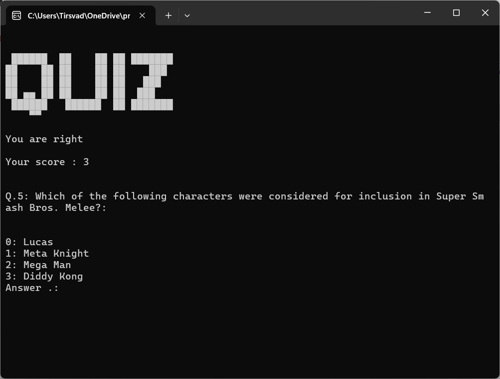

[![Contributors][contributors-shield]][contributors-url]
[![Forks][forks-shield]][forks-url]
[![Stargazers][stars-shield]][stars-url]
[![Issues][issues-shield]][issues-url]
[![MIT License][license-shield]][license-url]
[![LinkedIn][linkedin-shield]][linkedin-url]

[//]: # ([![PyPi][pypi-shield]][pypi-url])

[//]: # ([![Coveralls][coveralls-shield]][coverall-url])

[//]: # (![PyPiPythonVer][pypipyver-shield])

<br />
<div align="center">
    <a href="https://github.com/TirsvadCLI/Python.Game.Quiz">
        
    </a>
    <h3 align="center">Quiz</h3>
    <p align="center">
    <!-- PROJECT DESCRIPTION -->
    <br />
    <br />
    <!-- PROJECT SCREENSHOTS -->
    <a href="https://github.com/TirsvadCLI/Python.Game.Quiz/blob/main/images/screenshot01.png">
        
    </a>
    <br />
    <a href="https://github.com/TirsvadCLI/Python.Game.Quiz"><strong>Explore the docs »</strong></a>
    <br />
    <br />
    <a href="https://github.com/TirsvadCLI/Python.Game.Quiz/issues/new?labels=bug&template=bug-report---.md">Report Bug</a>
    ·
    <a href="https://github.com/TirsvadCLI/Python.Game.Quiz/issues/new?labels=enhancement&template=feature-request---.md">Request Feature</a>

  </p>
</div>

# Quiz

<!-- PROJECT DESCRIPTION -->

# Getting Started

This is an example of how you may give instructions on setting up your project locally. To get a local copy up and
running follow these simple example steps.

## Prerequisites

You have python 3 installed.

Python module QuizEngine4Trivia-TirsvadCLI
```console
pip install QuizEngine4Trivia-TirsvadCLI
```


## Installation

In a terminal do following

```console
mkdir Quiz
curl -L https://api.github.com/repos/TirsvadCLI/Python.Game.Quiz/tarball | tar -xz --strip-components=3 -C Quiz
```

For run the application go to the folder Quiz and run.

```commandline
cd Quiz
python main.py
```

## Contributing

Contributions are what make the open source community such an amazing place to learn, inspire, and create. Any
contributions you make are greatly appreciated.

If you have a suggestion that would make this better, please fork the repo and create a pull request. You can also
simply open an issue with the tag "enhancement". Don't forget to give the project a star! Thanks again!

Fork the Project

<ol>
    <li>Fork the Project</li>
    <li>Create your Feature Branch</li>
    <li>Commit your Changes</li>
    <li>Push to the Branch</li>
    <li>Open a Pull Request</li>
</ol>

Example

```commandline
git checkout -b feature
git commit -m 'Add my feature enhance to project'
git push origin feature
```

<!-- MARKDOWN LINKS & IMAGES -->
<!-- https://www.markdownguide.org/basic-syntax/#reference-style-links -->

[contributors-shield]: https://img.shields.io/github/contributors/TirsvadCLI/Python.Game.Quiz?style=for-the-badge
[contributors-url]: https://github.com/TirsvadCLI/Python.Game.Quiz/graphs/contributors

[forks-shield]: https://img.shields.io/github/forks/TirsvadCLI/Python.Game.Quiz?style=for-the-badge
[forks-url]: https://github.com/TirsvadCLI/Python.Game.Quiz/network/members

[stars-shield]: https://img.shields.io/github/stars/TirsvadCLI/Python.Game.Quiz?style=for-the-badge
[stars-url]: https://github.com/TirsvadCLI/Python.Game.Quiz/stargazers

[issues-shield]: https://img.shields.io/github/issues/TirsvadCLI/Python.Game.Quiz?style=for-the-badge
[issues-url]: https://github.com/TirsvadCLI/Python.Game.Quiz/issues

[license-shield]: https://img.shields.io/github/license/TirsvadCLI/Python.Game.Quiz?style=for-the-badge
[license-url]: https://github.com/TirsvadCLI/Python.Game.Quiz/blob/master/LICENSE.txt

[linkedin-shield]: https://img.shields.io/badge/-LinkedIn-black.svg?style=for-the-badge&logo=linkedin&colorB=555
[linkedin-url]: https://www.linkedin.com/in/jens-tirsvad-nielsen-13b795b9/


[coveralls-shield]: https://img.shields.io/coverallsCoverage/github/TirsvadCLI/Python.Quiz?style=for-the-badge
[coverall-url]: https://coveralls.io/github/TirsvadCLI/Python.Quiz

[pypi-shield]: https://img.shields.io/pypi/v/Quiz-TirsvadCLI?style=for-the-badge
[pypi-url]: https://pypi.org/project/Quiz-TirsvadCLI

[pypipyver-shield]: https://img.shields.io/pypi/pyversions/Quiz-TirsvadCLI?style=for-the-badge

